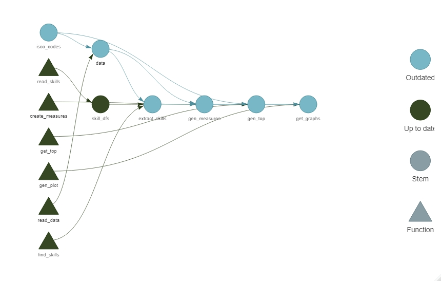
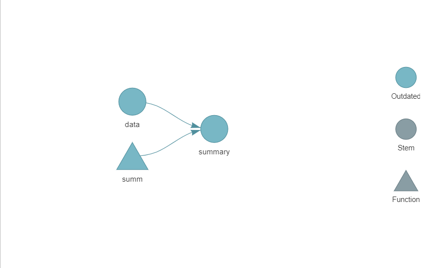
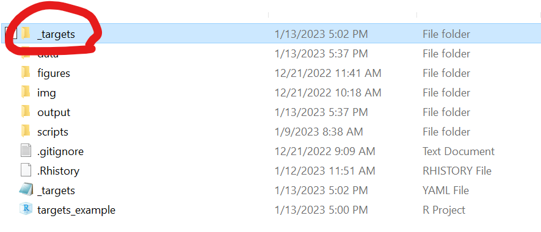
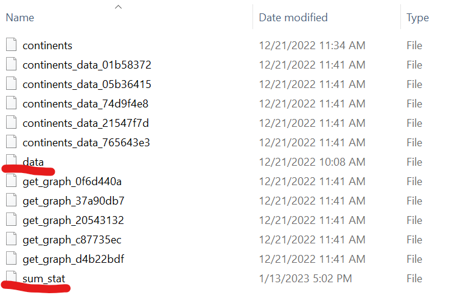

<!-- Print to PDF -->

<!-- Follow this: https://quarto.org/docs/presentations/revealjs/presenting.html#print-to-pdf -->

<!-- Use chrome and not firefox -->

# Introduction

<br>

::: {.callout-important icon="false" appearance="simple"}
This training aims to teach you on how to use the targets package.
:::

## How I coded before I learned about 'targets'

<br>

-   one code file
-   one change -\> man(code) hunt
-   rerun the whole file multiple times

## What is so special about the targets package?

<br>

[According to the {targets} R package user manual
website](https://books.ropensci.org/targets/)

-   can maintain a reproducible workflow without much repetition
-   skips tasks that are already up to date
-   runs only the necessary computation
-   supports implicit parallel computing
-   shows tangible evidence that the results match the underlying code
    and data

<!-- https://talks.andrewheiss.com/2022-seacen/presentation/#/general-principles -->

## Prerequisite

<br>

::: {.callout-important icon="false" appearance="simple"}
This training is for people who have intermediate knowledge of R
programming!

You should have at least the following experiences:

you have

-   ***created your own custom function***
-   called(sourced) a different code file
-   created an R project
:::

## Example

<br>

preservea095c9b616dd4efb

## Example

<br>

{fig.align = "center"}

## Example

<br>

targets also allows users to automatically know how long each step and
the whole process take

{fig.align="center"}

## Ideal workflow

<br>

1.  Visualize your whole project workflow in your head
2.  Divide the workflow into separate steps
3.  Create a custom function that does the work for each step
4.  Using these functions, implement the targets package

## Basic workflow

<br>

1.  Without targets package, finish coding
2.  Divide your workflow into separate steps
3.  Create a custom function that does the work for each step
4.  Using these functions, implement the targets package

## 'targets' is not a panacea

<br>

'targets' is not a package you should use every time!

Actually it is quite cumbersome to implement the package

Thus, implement only if:

-   you probably have to repeat your whole code lines multiple times 
-   the overall structure of your coding would be complex

<br>

If it is a one-time job it is better not to use targets package!

# Basics

## Let's install the targets package

<br>


::: {.cell}

```{.r .cell-code}
#installing the targets package
install.packages("targets")
```
:::


## Creating an R project!

I strongly advise you to create an R project for your each work/research
project!

Let's create a "gapminder" project at your desktop.

<br>

Follow the section 6 of this
[webpage.](https://bookdown.org/daniel_dauber_io/r4np_book/starting-your-r-projects.html)

## Creating the one and only

<br>

Using the targets package, you should create the main R script by typing
the following function!

Let's type the code lines in the R console which is the bottom left
pane.


::: {.cell}

```{.r .cell-code}
#calling the targets package
library(targets)
#creating the _targets.R script file
tar_script()
```
:::


Now you should have \_targets.R file in your project folder.

## The name & position matters!

<br>

-   Do not change the name of this \_targets.R file

-   the targets package will search and run the \_targets.R
    file(default)

-   the \_targets.R file should be directly placed at the project folder

<br>

Of course it is possible to change the location and the name of
\_targets.R file. 

For this, check out the Appendix part.

## \_targets.R file

<br>

Let's open the \_targets.R file

By default, it would explain the basic structure of the \_targets.R
file.

## basic structure of the \_targets.R

<br>

Let's check the first seven lines of code.


::: {.cell}

```{.r .cell-code}
library(targets)
# This is an example _targets.R file. Every
# {targets} pipeline needs one.
# Use tar_script() to create _targets.R and tar_edit()
# to open it again for editing.
# Then, run tar_make() to run the pipeline
# and tar_read(summary) to view the results.
```
:::


## basic structure of the \_targets.R

<br>

Next, you can directly define functions here


::: {.cell}

```{.r .cell-code}
# Define custom functions and other global objects.
# This is where you write source(\"R/functions.R\")
# if you keep your functions in external scripts.
summ <- function(dataset) {
  summarize(dataset, mean_x = mean(x))
}
```
:::


## basic structure of the \_targets.R

<br>

OR

save multiple custom functions at a certain folder and call them.

Let's assume we have created functions.R script file that has your
custom functions and stored it at "...\\gapminder\\scripts\\functions"
folder.


::: {.cell}

```{.r .cell-code}
#calling the functions.R script file
source("scripts/functions/functions.R")
```
:::


## basic structure of the \_targets.R

preserve4b6c78460bd52578


## basic structure of the \_targets.R

<br>

calling packages that you would need in the whole process


::: {.cell}

```{.r .cell-code}
# Set target-specific options such as packages.
tar_option_set(packages = c("dplyr", "stringr", "stringi", 
                            "ggplot2", "data.table", "gapminder"))
```
:::


## basic structure of the \_targets.R

<br>

Defining your whole workflow


::: {.cell}

```{.r .cell-code}
# End this file with a list of target objects.
list(
  #step 1 
  tar_target(data, #defining the step name
             #defining what the step will do
             data.frame(x = sample.int(100), y = sample.int(100))
             #creating a data frame
             ), 
  #step 2
  tar_target(summary, #defining the step name
             #calculating the average of x & y
             summ(data)) 
)
```
:::


## visualizing the workflow!

<br>

There is a way to visualize the whole workflow


::: {.cell}

```{.r .cell-code}
#you need to additionally install visNetwork package
#to run this function!
tar_visnetwork()
```
:::


## visualizing the workflow!

<br>

{fig.align="center"}

## visualizing the workflow!

You can interact with the graph!

If you click a shape, it shows its related dependencies.

{fig.align="center"}

# Simple example

## objective of this project

<br>

Using a data set from the gapminder package,

generating a table that contains

-   average life expectancy per continent and year
-   average GDP per capita per continent and year

## checking the data

Let's check how the data is organized


::: {.cell}

```{.r .cell-code}
library(gapminder)
data <- gapminder
head(data)
"# A tibble: 6 × 6
  country     continent  year lifeExp      pop gdpPercap
  <fct>       <fct>     <int>   <dbl>    <int>     <dbl>
1 Afghanistan Asia       1952    28.8  8425333      779.
2 Afghanistan Asia       1957    30.3  9240934      821.
3 Afghanistan Asia       1962    32.0 10267083      853.
4 Afghanistan Asia       1967    34.0 11537966      836.
5 Afghanistan Asia       1972    36.1 13079460      740.
6 Afghanistan Asia       1977    38.4 14880372      786."
```
:::


## creating the table

Let's create the summary table


::: {.cell}

```{.r .cell-code}
sum.df <- data %>%
  group_by(continent, year) %>%
  summarise(avg_lifeExp = mean(lifeExp),
            avg_gdpPercap = mean(gdpPercap))
head(sum.df)
"  continent  year avg_lifeExp avg_gdpPercap
  <fct>     <int>       <dbl>         <dbl>
1 Africa     1952        39.1         1253.
2 Africa     1957        41.3         1385.
3 Africa     1962        43.3         1598.
4 Africa     1967        45.3         2050.
5 Africa     1972        47.5         2340.
6 Africa     1977        49.6         2586."
```
:::


## integrating the workflow into the targets package!

Let's create a function that returns the ***sum.df***

and save the function in an R script file "functions.R"

under the directory "...gapminder\\scripts" folder


::: {.cell}

```{.r .cell-code}
get_sum_table <- function(data){
  #getting average life expectancy &  average gdpPercap per continent & year
  sum.df <-  data %>%
    group_by(continent, year) %>%
    summarise(avg_lifeExp = mean(lifeExp),
              avg_gdpPercap = mean(gdpPercap))
  return(sum.df)
}
```
:::


## creating \_targets.R

Let's create the \_targets.R file by typing tar_script() in the R
console


::: {.cell}

```{.r .cell-code}
library(targets)
tar_script()
```
:::


## setting \_targets.R file {auto-animate="true"}

First, let's set which R script file and

which packages we will use our project


::: {.cell}

```{.r .cell-code}
library(targets)
#calling in the 
source("scripts/functions.R")
#if you need to call different R scripts
#source("R/different_code.R") 

# Set packages.
##calling in dplyr, ggplot2, gapminder packages
tar_option_set(packages = c("dplyr", "ggplot2", "gapminder"))
```
:::


## setting \_targets.R file {auto-animate="true"}

Let's specify the steps in our project

``` {.r code-line-numbers="10-20"}
library(targets)
#calling in the 
source("scripts/functions.R")
#if you need to call different R scripts
#source("R/different_code.R") 

# Set packages.
##calling in dplyr, ggplot2, gapminder packages
tar_option_set(packages = c("dplyr", "ggplot2", "gapminder"))

# End this file with a list of target objects.
list(
  #reading in the gapminder data
  tar_target(data, 
             as.data.table(gapminder::gapminder)),
  #getting average life expectancy &
  #average GDP per capita per continent & year
  tar_target(sum_stat,
             get_sum_table(data))
)
```

## Checking the workflow

Now let's check the workflow of our project


::: {.cell}

```{.r .cell-code}
#visualize the whole workflow
tar_visnetwork()
```
:::


If the \_targets.R file has been wrongly set,

it would generate an error message!

## Let's run this!

If no errors were produced, let's run the script.


::: {.cell}

```{.r .cell-code}
#Running the whole script
tar_make()
```
:::


## successful execution

{fig.align="center"}

## how can I access the output?

<br>

-   targets automatically stores the output of each step!

{fig.align="center"}

## how can I access the output?

{fig.align="center"}

## how can I access the output?

{fig.align="center"}

## Accessing the output files

You can read the files in the R studio by


::: {.cell}

```{.r .cell-code}
#reading the output of the step "sum_stat"
##only works if you set the working directory as
##the project folder
sum.df <- tar_read(sum_stat)

"OR"

#by default files are stored in RDS format
sum.df <- readRDS("_targets/objects/sum_stat")
```
:::


Also, you can change the data format of the outputs(check the appendix
part)

# complex Example

## Without targets

<br>

Now let's start a more advanced example.

Let's say, I would like to do an econometric analysis for each
continent.

The usual way to do this is like below:


::: {.cell}

```{.r .cell-code}
#pseudo code
#clean data
cleaned.df <- clean_data(continent)
for(continent in continents){
  #econometric analysis
  result <- regress(cleaned.df)
  
  #table
  result_table <- gen_table(result)
  
  #graphs
  graphs <- gen_plot(result)
}
```
:::


## With targets

<br>

With targets you can do this automatically!

Let


## Example setting

<br>

Let's try to graph the temporal change of life expectancy of countries in each continent.

# Parallelization

## 

# Thanks!

<br>

Special thanks to [Etienne Bacher](https://github.com/etiennebacher) for
his help and slide codes!

<br>

Source code for slides:

[https://github.com/jongohkim91/R-A-Z/index.qmd](https://github.com/jongohkim91/R-A-Z/tree/master/markdown){.external
target="_blank"}

<br>

# Good resources

R for Data Science from Hadley Wickham and Garrett Grolemund:

[https://r4ds.had.co.nz/](https://r4ds.had.co.nz/){.external
target="_blank"}

<br>

ggplot2:

[https://ggplot2.tidyverse.org/](https://ggplot2.tidyverse.org/){.external
target="_blank"}

<br>

R Markdown: The Definitive Guide from Yihui Xie, J. J. Allaire, and
Garrett Grolemund:

[https://bookdown.org/yihui/rmarkdown/](https://bookdown.org/yihui/rmarkdown/){.external
target="_blank"}

# Appendix

## changing the name/location of \_targets.R

targets package automatically runs \_targets.R file located at the
project directory

to change this,


::: {.cell}

```{.r .cell-code}
#telling targets to run _targets_pattern.R 
#located at ".../scripts"
tar_config_set(script = "scripts/2._targets_pattern.R")
```
:::


## changing the data format for output files

changing to parquet format


::: {.cell}

:::

